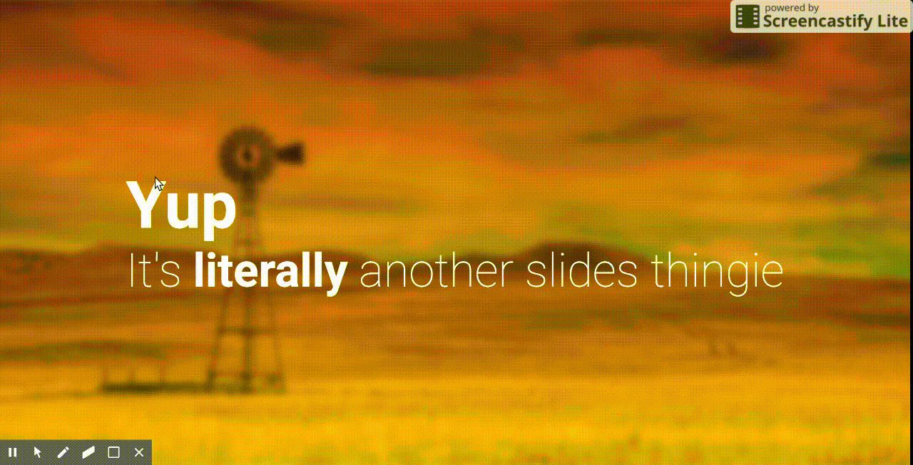

This repo is forked from the awesome and mighty [Meownica](https://meowni.ca), for detail usage please go to [Original Repo](https://github.com/notwaldorf/literally).

This repo added 2 thingie: 

1. Press <kbd>F</kbd> to toggle a spotlight, and <kbd>D</kbd> to expand, <kbd>G</kbd> to shrink the circle.


2. Elements within `<a-slide>` now have a `step` attribute. Every child with a `step` attribute is invisible by default, and ordered by its `step` value. Press <kbd>.</kbd> to show the next element, and <kbd>,</kbd> to hide the last shown one.


    **Example**: 
    ```html
    <div step="1">Show first</div>
    <div step="3">Show last</div>
    <div step="2">Show second</div>
    <div step="2">Also the second</div>

    <!-- or -->
    <div step>Empty value go first</div>
    <div step="3">Then numbers, after 2</div>
    <div step="2">Then numbers, before 3</div>
    <div step="string">String value comes the last</div>
    ```